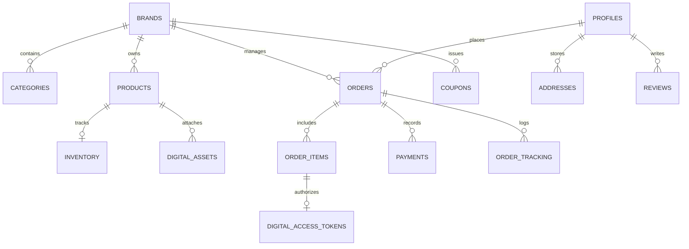

# 📐 Anshuman Enterprises (anshumanenterprises.online) — Comprehensive Master Design & System Architecture Specification

> **Official Website:** [anshumanenterprises.online](https://anshumanenterprises.online/)  
> **Brand Name:** Anshuman Enterprises  
> **Document Version:** 3.0 (Master Production Edition)  
> **Repository:** `anshumanenterprises1119/Anshuman`  
> **Target Audience:** B2B Wholesale Electrical Buyers, Commercial Contractors, Building Developers, Retailers, & Residential Customers across Greater Noida and Delhi NCR  

---

## 📑 Table of Contents
1. [Executive Summary & Business Strategy](#1-executive-summary--business-strategy)
2. [Visual Design System & UI/UX Tokens](#2-visual-design-system--uiux-tokens)
3. [Brand Identity & Visual Assets](#3-brand-identity--visual-assets)
4. [Full System Architecture & Technology Stack](#4-full-system-architecture--technology-stack)
5. [Database Schema & ERD Specifications](#5-database-schema--erd-specifications)
6. [UI/UX Component Architecture & Wireframes](#6-uiux-component-architecture--wireframes)
7. [Comprehensive Sitemap & Page Specifications](#7-comprehensive-sitemap--page-specifications)
8. [Interactive Automation & Client-Side Scripts](#8-interactive-automation--client-side-scripts)
9. [SEO Architecture & Structured JSON-LD Data](#9-seo-architecture--structured-json-ld-data)
10. [Third-Party Integration Specifications](#10-third-party-integration-specifications)
11. [Security, Performance & Deployment Protocols](#11-security-performance--deployment-protocols)

---

## 1. 🌟 Executive Summary & Business Strategy

**Anshuman Enterprises** is a leading wholesale electrical, hardware, CCTV security surveillance, and industrial automation provider based in Sector 1, Greater Noida, Uttar Pradesh. 

### 1.1 Core Business Model
* **Physical B2B Wholesale Distribution:** Authorized supplier of 100% genuine electrical items from industry leaders:
  * Wires & Cables (*Polycab, Havells, KEI, RR Kabel*)
  * Modular Switches & Accessories (*Havells Crabtree, Anchor by Panasonic, CONA*)
  * Commercial & Domestic Lighting (*Philips, Syska, Orient Electric*)
  * Power Distribution & Protection (*L&T, Havells MCBs & DB Boxes*)
  * Hardware & Power Tools (*Bosch blades, SDS drill bits, conduit pipes*)
* **Digital & Automation Division (*FutureWithAI*):** Multi-brand digital marketplace offering software automation packages, n8n workflow templates, and digital toolkits.
* **Turnkey Services:** Professional CCTV surveillance setup, biometric access control, commercial electrical planning, and network cabling.

---

## 2. 🎨 Visual Design System & UI/UX Tokens

The visual language balances **royal Indian trust, heritage, and luxury** (rich maroon & gold) with **modern digital efficiency and high contrast clarity**.

```
┌─────────────────────────────────────────────────────────────────────────┐
│                        COLOR PALETTE PREVIEW                            │
│  [#3d0e14] Dark Maroon  |  [#6b1c23] Royal Maroon  |  [#c9a84c] Gold   │
│  [#e8c96a] Light Gold   |  [#faf7f2] Soft Cream    |  [#25D366] WhatsApp│
└─────────────────────────────────────────────────────────────────────────┘
```

### 2.1 CSS Variables & Design Tokens (`:root`)
```css
:root {
  /* Brand Primary Colors */
  --maroon-dark:  #3d0e14; /* Navigation Header, Footer, Deep Backgrounds */
  --maroon:       #6b1c23; /* Primary Buttons, Headers, Brand Accent */
  --maroon-mid:   #8a2530; /* Hover states, Secondary Accents */

  /* Gold Luxury Accents */
  --gold:         #c9a84c; /* Call to Action, Star Ratings, Borders */
  --gold-light:   #e8c96a; /* Text Highlights, Subtitles, Glow Effects */
  --gold-pale:    #f5ead5; /* Pill Backgrounds, Soft Highlight Boxes */

  /* Surfaces & Backgrounds */
  --cream:        #faf7f2; /* Body Background (Eye-pleasing non-glare) */
  --cream-dark:   #f0ebe1; /* Card Fill, Alternating Section Canvas */
  --white:        #ffffff; /* Card Backgrounds, Modal Surfaces */

  /* Typography Colors */
  --text:         #1a1a1a; /* Main High-Contrast Text */
  --text-mid:     #4a4040; /* Subtitles, Body Paragraphs */
  --text-light:   #8a7a7a; /* Meta Info, Captions, Timestamps */

  /* Structural Tokens */
  --border:       rgba(107, 28, 35, 0.12);
  --shadow-sm:    0 2px 12px rgba(61, 14, 20, 0.08);
  --shadow-md:    0 8px 32px rgba(61, 14, 20, 0.14);
  --shadow-lg:    0 20px 60px rgba(61, 14, 20, 0.18);
  --radius-sm:    6px;
  --radius-md:    12px;
  --radius-pill:  50px;
}
```

### 2.2 Typography Specification
| Role | Font Family | Fallback | Applied Elements |
| :--- | :--- | :--- | :--- |
| **Display / Brand** | `'Cormorant Garamond'` | Serif | `h1`, `h2`, Brand Header, Hero Headlines, Section Titles |
| **Body / Interface** | `'DM Sans'` | Sans-Serif | Paragraphs, Navigation, Form Inputs, Product Titles |
| **Data / SKU / Price**| `'DM Mono'` | Monospace | SKU Codes, Model Numbers, Price Tables, Order IDs |

```css
/* Typography Scale */
h1 { font-family: 'Cormorant Garamond', serif; font-size: clamp(2.2rem, 5vw, 3.5rem); font-weight: 700; line-height: 1.15; }
h2 { font-family: 'Cormorant Garamond', serif; font-size: clamp(1.8rem, 3.5vw, 2.5rem); font-weight: 600; }
h3 { font-family: 'DM Sans', sans-serif; font-size: 1.25rem; font-weight: 600; }
p  { font-family: 'DM Sans', sans-serif; font-size: 1rem; line-height: 1.65; color: var(--text-mid); }
```

---

## 3. 🖼 Brand Identity & Visual Assets

### 3.1 Logo & Favicon Assets Matrix
* **Primary Brand Logo:** `/primary-logo.webp` (Light background) / `/logo.webp` (Dark header bar).
* **Icon Mark:** `/icon-logo.png` (869 KB master resolution).
* **Favicon Suite:**
  * `/favicon.ico` (Legacy multi-resolution icon)
  * `/favicon-16x16.png`, `/favicon-32x32.png`, `/favicon-48x48.png`
  * `/favicon-96x96.png`, `/favicon-144x144.png`, `/favicon-192x192.png` (PWA standard)

### 3.2 Hero Banner & Visual Assets
* **Hero Backgrounds (WebP Optimized):**
  * `electrical_bg_1778688113768.webp` (Electrical Cable & Power Supplies)
  * `cctv_bg_1778688143741.webp` (CCTV Security & Surveillance)
  * `network_bg_1778688160174.webp` (Network Cabling & Server Racks)
  * `security_bg_1778688188651.webp` (Smart Door Locks & Biometrics)

---

## 4. 🏗 Full System Architecture & Technology Stack

The platform operates on a hybrid architecture combining static HTML5 performance with dynamic Next.js + Supabase cloud features.

```
                                    🌐 CLIENT LAYER
                  ┌─────────────────────────────────────────────────┐
                  │          anshumanenterprises.online             │
                  │  Static HTML5 + Next.js App Router Hybrid Pages │
                  └────────────────────────┬────────────────────────┘
                                           │
                                ⚡ INTERACTIVE SERVICES
        ┌──────────────────────────────────┼──────────────────────────────────┐
        ▼                                  ▼                                  ▼
┌──────────────────┐            ┌──────────────────┐            ┌──────────────────┐
│ Client Search    │            │  AI Chatbot      │            │ Supabase Auth &  │
│ Engine           │            │ Engine           │            │ Dynamic API      │
│ (search_data.js) │            │ (chatbot.js)     │            │ (Next.js /api)   │
└──────────────────┘            └──────────────────┘            └────────┬─────────┘
                                                                         │
                                                               💾 BACKEND LAYER
                                                     ┌───────────────────┴───────────────────┐
                                                     ▼                                       ▼
                                          ┌────────────────────┐                  ┌────────────────────┐
                                          │ PostgreSQL DB      │                  │ Supabase Storage   │
                                          │ (Supabase Managed) │                  │ (Public & Private) │
                                          └────────────────────┘                  └────────────────────┘
```

### Stack Breakdown:
1. **Frontend UI Engine:**
   - HTML5 with Semantic Schema Annotations
   - Custom CSS Design System
   - Vanilla ES6 JavaScript (No bloated external dependencies)
   - Next.js 14 (App Router) for multi-brand e-commerce (`/ecommerce-platform`)
2. **Backend & Database:**
   - **Supabase Cloud (PostgreSQL 15):** User profiles, Orders, Inventory, Products, Coupons.
   - **Row-Level Security (RLS):** Strict policy enforcement per authenticated user.
3. **Storage Buckets:**
   - `product-assets` (Public bucket for images, catalogues, webp media).
   - `digital-downloads` (Private bucket for protected software zips & PDF files).

---

## 5. 🗄 Database Schema & ERD Specifications

The system uses a unified multi-brand relational database schema:



### Table Definitions Summary:
1. **`BRANDS`**: Stores brand entities (*Anshuman Enterprises*, *FutureWithAI*).
2. **`PRODUCTS`**: Physical and digital items with base price, sale price, SKU, metadata JSONB.
3. **`INVENTORY`**: Stock quantity, reserved counts, low-stock threshold triggers.
4. **`DIGITAL_ASSETS`**: Protected files in Supabase Storage with download limits.
5. **`ORDERS` & `ORDER_ITEMS`**: Full transaction records, order statuses (`pending`, `processing`, `shipped`, `delivered`).
6. **`PAYMENTS`**: Transaction log with PhonePe gateway integration parameters.
7. **`DIGITAL_ACCESS_TOKENS`**: Expiring signed download links (15-minute access tokens).

---

## 6. 🧩 UI/UX Component Architecture & Wireframes

### 6.1 Sticky Navigation Header (`<nav>`)
```
[ LOGO ] Anshuman Enterprises | Home  Products  Services  Catalogues  About  FAQ  Contact | [📞 Call]  [💬 WhatsApp]
```
- **Height:** 64px (Desktop) / 56px (Mobile).
- **Background:** `var(--maroon-dark)` with `backdrop-filter: blur(10px)`.
- **CTA Buttons:** Pill rounded buttons with hover scale animations (`transform: translateY(-1px)`).

---

### 6.2 Hero Section Glassmorphism Wireframe
```
+-----------------------------------------------------------------------------------+
|  [Background Image: electrical_bg.webp]                                           |
|                                                                                   |
|  +-----------------------------------------------------------------------------+  |
|  |  Anshuman Enterprises                                                       |  |
|  |  #1 Wholesale Electrical & CCTV Hardware Supplier in Greater Noida         |  |
|  |                                                                             |  |
|  |  [🔍 Search Cables, Switches, MCBs...]  [📥 Download PDF Catalogue]          |  |
|  +-----------------------------------------------------------------------------+  |
|                                                                                   |
+-----------------------------------------------------------------------------------+
```

---

### 6.3 Product Card Layout Specification
```
+-------------------------------------------------------+
| [ Image: Product WebP / Lazy Loading ]                |
| Tag: [ Polycab / Havells / Bosch ]                    |
|                                                       |
| 3-Core Flexible Copper Armoured Cable                 |
| SKU: AE-CAB-1029 | 90m Roll                           |
|                                                       |
| Price: ₹2,450  <s>₹3,200</s>  (Wholesale Bulk Rate)  |
|                                                       |
| [ 💬 WhatsApp Order ]   [ ℹ️ View Details ]           |
+-------------------------------------------------------+
```

---

### 6.4 AI Chatbot Widget (`chatbot.js`)
- **Trigger Button:** Bottom-Right floating circle icon (`var(--maroon)` background, gold border).
- **Knowledge Engine:** `chatbot_knowledge.js` containing FAQs, pricing guidelines, store hours, map locations, and contact details.
- **Features:** Auto-suggested quick question chips, WhatsApp redirect buttons, instant responsive messaging.

---

## 7. 📑 Comprehensive Sitemap & Page Specifications

### 7.1 Storefront & Core Pages
* `index.html` — Main Homepage & Wholesale Hub.
* `products.html` — Complete searchable & filterable product catalog (300+ items).
* `our-catalogue.html` — PDF price list download directory for all major brands.
* `services.html` — Overview of electrical contracting & surveillance services.
* `about.html` — Founder profile, showroom gallery, Sector 1 store details.
* `contact.html` — Interactive Google Maps integration, direct contact cards, inquiry form.
* `faq.html` — FAQ accordion powered by structured schema.
* `projects.html` — Portfolio showcase of completed residential & commercial installations.
* `privacy.html`, `terms.html`, `refund-shipping.html` — Compliance & policy documentation.

### 7.2 Service Landing Pages
* `cctv-installation.html` — Residential & Commercial CCTV Solutions.
* `biometrics-access-control.html` — Biometric Scanners & Fingerprint Access.
* `commercial-electrical.html` & `commercial-electrical-planning.html` — Industrial Wiring & Panels.
* `distribution-boards.html` — MCBs, DB Boxes, Changeover Switches.
* `interior-lighting.html` & `led-lighting.html` — Architectural LED & Decorative Lights.
* `modular-switches.html` — Premium Switches, Sockets, Modular Plates.
* `network-rack-setup.html` & `structured-cabling.html` — Server Racks & Patch Panels.
* `smart-door-locks.html` & `video-door-phones.html` — Smart Home Security Systems.
* `wifi-access-points.html` — Commercial Wireless Access Point Installation.
* `wires-cables.html` — Industrial Armoured Cables & House Wires.

---

## 8. ⚙️ Interactive Automation & Client-Side Scripts

The workspace relies on a robust JavaScript automation workflow:

```
[ Catalog DB / Data ]
         │
         ├──> build_products_html.js -------> Generates HTML product detail pages
         ├──> seo_optimize.js --------------> Injects JSON-LD & OpenGraph meta
         ├──> export_indiamart_csv.js ------> Generates IndiaMART upload format CSV
         └──> update_pages_logos.js --------> Batch updates logo & favicon links
```

### Automation Script Matrix:
1. `build_products_html.js`: Reads product datasets and programmatically compiles HTML pages.
2. `seo_optimize.js`: Automatically audits canonical tags, meta titles, descriptions, and JSON-LD schema blocks.
3. `export_indiamart_csv.js`: Prepares `indiamart_products_upload.csv` for bulk B2B catalog sync.
4. `audit_links.js` & `fix_broken_links.js`: Ensures zero broken links across all static pages.

---

## 9. 🔍 SEO Architecture & Structured JSON-LD Data

Every landing page enforces strict technical SEO compliance:

### 9.1 LocalBusiness Schema (`index.html`)
```json
{
  "@context": "https://schema.org",
  "@type": "LocalBusiness",
  "name": "Anshuman Enterprises",
  "image": "https://anshumanenterprises.online/logo.webp",
  "@id": "https://anshumanenterprises.online",
  "url": "https://anshumanenterprises.online",
  "telephone": "+917065815743",
  "address": {
    "@type": "PostalAddress",
    "streetAddress": "Shop No. 5, Sector 1",
    "addressLocality": "Greater Noida",
    "addressRegion": "UP",
    "postalCode": "201306",
    "addressCountry": "IN"
  },
  "geo": {
    "@type": "GeoCoordinates",
    "latitude": 28.4744,
    "longitude": 77.5040
  },
  "openingHoursSpecification": {
    "@type": "OpeningHoursSpecification",
    "dayOfWeek": ["Monday", "Tuesday", "Wednesday", "Thursday", "Friday", "Saturday", "Sunday"],
    "opens": "09:00",
    "closes": "21:00"
  },
  "priceRange": "$$"
}
```

---

## 10. 🔌 Third-Party Integration Specifications

| Integration | Technology | Purpose |
| :--- | :--- | :--- |
| **PhonePe PG** | REST API / Salt Key HMAC | Digital Payments via UPI, Cards, Net Banking |
| **Fast2SMS** | SMS Gateway API | User authentication & Order confirmation OTPs |
| **Shiprocket** | Logistics API | Automated tracking numbers & shipping cost estimation |
| **WhatsApp Business**| Direct API `https://wa.me/917065815743` | Instant wholesale quotes & product inquiries |

---

## 11. 🛡️ Security, Performance & Deployment Protocols

### 11.1 Security Standards
- **PostgreSQL Row-Level Security (RLS):** Restricts customer access to their own orders and addresses.
- **Protected Downloads:** Signed URLs valid for 15 minutes prevent hotlinking of digital assets.
- **Environment Isolation:** Credentials stored securely in `.env.local`.

### 11.2 Performance Metrics Target
- **First Contentful Paint (FCP):** < 1.0s
- **Largest Contentful Paint (LCP):** < 1.8s
- **Cumulative Layout Shift (CLS):** 0.00
- **PageSpeed Score:** > 95/100 (Desktop & Mobile)

---

## 📌 Document Certification
This master design document represents the complete production blueprint for **anshumanenterprises.online**.
