# Phase 1: Architecture Specification Report

This document outlines the system architecture, database entities, storage guidelines, API paths, and deployment specifications.

---

## 1. Entity-Relationship (ER) Diagram

```mermaid
erDiagram
    BRANDS {
        uuid id PK
        text name
        text slug UK
        text domain
        timestamp created_at
    }
    PROFILES {
        uuid id PK "FK to auth.users"
        text email UK
        text full_name
        text phone_number
        text role "customer, staff, admin"
        timestamp created_at
        timestamp updated_at
    }
    ADDRESSES {
        uuid id PK
        uuid profile_id FK
        text type "shipping, billing"
        text address_line1
        text address_line2
        text city
        text state
        text postal_code
        text country
        boolean is_default
    }
    CATEGORIES {
        uuid id PK
        uuid brand_id FK
        text name
        text slug
        uuid parent_id FK
        text description
    }
    PRODUCTS {
        uuid id PK
        uuid brand_id FK
        text name
        text slug
        text description
        text type "physical, digital"
        text sku
        numeric base_price
        numeric sale_price
        boolean is_active
        jsonb metadata
    }
    INVENTORY {
        uuid id PK
        uuid product_id FK "unique"
        integer quantity
        integer reserved
        integer low_stock_threshold
    }
    DIGITAL_ASSETS {
        uuid id PK
        uuid product_id FK
        text file_path "Supabase Storage bucket path"
        text file_name
        bigint file_size
        integer access_duration_days
        integer download_limit
    }
    COUPONS {
        uuid id PK
        uuid brand_id FK
        text code UK
        text type "percentage, fixed_amount"
        numeric value
        numeric min_purchase_amount
        timestamp starts_at
        timestamp expires_at
        integer usage_limit
        integer usage_count
        boolean is_active
    }
    ORDERS {
        uuid id PK
        uuid brand_id FK
        uuid profile_id FK
        text order_number UK
        text status "pending, processing, shipped, delivered, cancelled"
        jsonb shipping_address
        jsonb billing_address
        numeric subtotal
        numeric discount_amount
        numeric shipping_fee
        numeric total_amount
        text payment_method "cod, upi, card"
        text payment_status "pending, paid, failed, refunded"
        uuid coupon_id FK
        text tracking_number
        text carrier
        timestamp created_at
        timestamp updated_at
    }
    ORDER_ITEMS {
        uuid id PK
        uuid order_id FK
        uuid product_id FK
        integer quantity
        numeric price
        numeric discount
        numeric total
    }
    DIGITAL_ACCESS_TOKENS {
        uuid id PK
        uuid order_item_id FK
        uuid profile_id FK
        text token UK
        timestamp expires_at
        integer download_count
        integer max_downloads
    }
    PAYMENTS {
        uuid id PK
        uuid order_id FK
        text transaction_id UK
        text gateway "phonepe, cod"
        numeric amount
        text status "pending, success, failed"
        jsonb raw_payload
        timestamp created_at
    }
    ORDER_TRACKING {
        uuid id PK
        uuid order_id FK
        text status
        text description
        text location
        timestamp timestamp
    }
    NOTIFICATIONS {
        uuid id PK
        uuid profile_id FK
        text title
        text message
        text type "order_update, promotion, download_ready"
        boolean is_read
        timestamp created_at
    }
    CMS_CONTENT {
        uuid id PK
        uuid brand_id FK
        text key UK
        text title
        jsonb content
        boolean is_published
        timestamp updated_at
    }
    REVIEWS {
        uuid id PK
        uuid product_id FK
        uuid profile_id FK
        integer rating "1 to 5"
        text comment
        timestamp created_at
    }
    SUPPORT {
        uuid id PK
        uuid profile_id FK
        text subject
        text message
        text status "open, resolved"
        timestamp created_at
    }

    BRANDS ||--o{ CATEGORIES : "has"
    BRANDS ||--o{ PRODUCTS : "has"
    BRANDS ||--o{ ORDERS : "owns"
    BRANDS ||--o{ COUPONS : "has"
    BRANDS ||--o{ CMS_CONTENT : "owns"
    PROFILES ||--o{ ADDRESSES : "manages"
    PROFILES ||--o{ ORDERS : "places"
    PROFILES ||--o{ DIGITAL_ACCESS_TOKENS : "uses"
    PROFILES ||--o{ NOTIFICATIONS : "receives"
    PROFILES ||--o{ REVIEWS : "writes"
    PROFILES ||--o{ SUPPORT : "creates"
    PRODUCTS ||--o{ ORDER_ITEMS : "included_in"
    PRODUCTS ||--o| INVENTORY : "monitored_by"
    PRODUCTS ||--o{ DIGITAL_ASSETS : "attaches"
    PRODUCTS ||--o{ REVIEWS : "gets"
    ORDERS ||--o{ ORDER_ITEMS : "contains"
    ORDERS ||--o{ ORDER_TRACKING : "tracked_by"
    ORDERS ||--o{ PAYMENTS : "billed_by"
    ORDER_ITEMS ||--o| DIGITAL_ACCESS_TOKENS : "authorizes"
```



---

## 2. Storage Architecture: Supabase Storage
Instead of Cloudflare R2, we use Supabase Storage buckets:
1.  `product-assets` (Public bucket)  
    *   Holds physical product visual pictures, icons, and logos.
    *   URL Scheme: `https://[project-ref].supabase.co/storage/v1/object/public/product-assets/[brand]/[product-slug]/image.webp`
2.  `digital-downloads` (Private bucket)  
    *   Holds private software, courses, zip archives, and PDF files.
    *   Access restricted via server API: files are requested via Next.js `/api/download` using Supabase Storage signed URLs (valid for 15 minutes).

---

## 3. Environment Config (`.env.local`)
```env
NEXT_PUBLIC_SUPABASE_URL=https://your-project.supabase.co
NEXT_PUBLIC_SUPABASE_ANON_KEY=your-anon-key
SUPABASE_SERVICE_ROLE_KEY=your-service-role-key

# Fast2SMS OTP Key
FAST2SMS_API_KEY=your-sms-key

# PhonePe PG Integration
PHONEPE_SALT_KEY=your-salt-key
PHONEPE_SALT_INDEX=1
```

---

## 4. Monitoring & Rollback Design
*   **Edge Analytics**: Integrated via Vercel Analytics and Microsoft Clarity.
*   **Database logs**: Triggers in PostgreSQL copy delete operations to `activity_logs` tables.
*   **Database Backups**: Supabase takes daily logical backups.
*   **Rollback Protocol**: Instant git revert deployment in Vercel.
